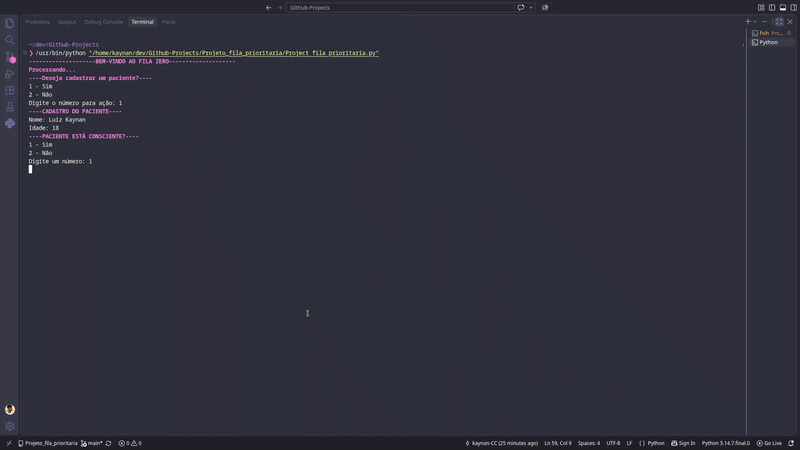

## Fila Zero — Sistema de Triagem por Prioridade

Sistema de triagem hospitalar em terminal que classifica pacientes por nível de urgência, simulando uma fila de prioridade real de pronto-socorro.

## 📋 Sobre o Projeto

O Fila Zero é um script em Python que simula o processo de triagem de pacientes em um pronto-socorro. A cada paciente cadastrado, o sistema faz uma série de perguntas (nível de consciência, categoria do sintoma e subtriagem específica) e, ao final, classifica o paciente em um nível de prioridade — de CRÍTICA a BAIXA — indicando o tempo estimado de atendimento.

O fluxo de triagem é dividido em quatro grandes categorias de sintomas:

🫁 Respiratória  
🤕 Dor  
🧠 Neurológica  
♿ Preferencial (gestantes, idosos e pessoas com deficiência)  

Cada categoria tem sua própria subtriagem, com perguntas específicas que definem o nível de urgência do paciente.

## 🚀 Acesse o projeto

Clone o repositório e rode o script localmente:

git clone https://github.com/kaynan-CC/Projeto_fila_prioritaria.git 
cd Projeto_fila_prioritaria 
python "Project fila prioritaria.py" 

## 📸 Preview

## 🛠️ Tecnologias Utilizadas

Python 3 
Biblioteca time (módulo sleep, para simular o tempo de processamento) 
Códigos ANSI para colorir a saída no terminal 

## 📝 Licença

Este projeto é aberto e pode ser utilizado livremente para fins educacionais e pessoais.

## 👨‍💻 Autor

Desenvolvido por Kaynan.

## 📧 Contato

Para dúvidas, sugestões ou reportar problemas, entre em contato ou abra uma issue no repositório.